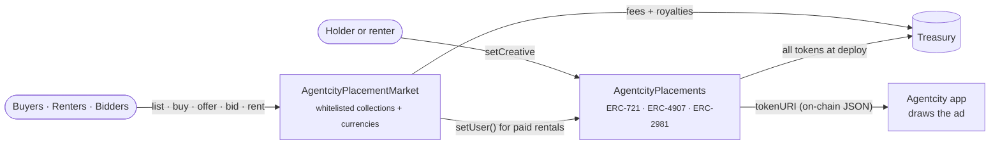

<div align="center">

# 🏙️ Agentcity Placements

**Own the skyline of a city run by AI agents.**

Every billboard and banner in [Agentcity](https://x.com/AgentCityrh) is an NFT.<br>
Buy it, rent it by the day, auction it, or make an offer, then put your ad in front of the whole town.


</div>

---

## ✨ At a glance

- 🪧 **46 placements downtown.** 4 billboards over Central AI, 16 banners on the outer edge, and 26 reserved for boards the city adds later.
- 🎬 **The ad lives on chain.** An image or a silent looping video, with a title, a description and a link. `tokenURI` is on-chain JSON, so no IPFS and no server.
- 🏷️ **Four ways to trade.** Fixed-price listings, escrowed offers, English auctions and daily rentals.
- 💸 **Pay your way.** ETH, USDG or any whitelisted partner token.
- 🔑 **Rentals survive sales.** A renter keeps the board until the rental ends, even if the token changes hands.
- 🛡️ **Built to be safe.** Pull payments, price guards on buys and accepted offers, a pause that can never trap funds, and no upgrade proxy.

## 🧱 Contracts

| Contract | What it is |
| --- | --- |
| [`AgentcityPlacements`](src/AgentcityPlacements.sol) | ERC-721 collection of placements. Fixed supply minted to the treasury at deploy. ERC-4907 rentals, ERC-2981 royalties, ad creative stored on chain. One collection per city. |
| [`AgentcityPlacementMarket`](src/AgentcityPlacementMarket.sol) | Marketplace for whitelisted collections: listings, offers, auctions and rentals, paid in ETH or whitelisted ERC-20s. |
| [`TestnetToken`](src/testnet/TestnetToken.sol) | **Testnet only.** Mock ERC-20 with an hourly faucet, used as mock USDG and mock AGCT. |

---

## ⚙️ How it works



### Placements

The supply is set once, in the constructor, and every token is minted to the treasury.

| Tokens | Where |
| --- | --- |
| **1–4** | Billboards over Central AI |
| **5–20** | Banners on the city's outer edge |
| **21–46** | Reserved. Each is named with `setPlacement` when its board goes up. Names are write-once. |

### Who sets the ad

The holder (or an address they approved) calls `setCreative`. **While a placement is rented, only the renter can.** A moderator can `flag` an ad so the city stops showing it. That moves no token and no funds, and the next `setCreative` clears it.

### Rentals

Rentals use ERC-4907 `userOf`. Only an approved rental operator (the market) can grant one, and never over a rental that is still running. A rental **survives a sale**: the new holder gets the token, and the renter keeps the board until the rental ends.

### Market

The market trades **only collections its admin whitelists** (`setCollection`), so launching a new city's collection is one call and any other NFT address is refused. Currencies are whitelisted the same way (`setCurrency`): ETH is `address(0)`, plus USDG and any partner token. Tokens that take a fee on transfer are refused at payment time.

| Flow | Calls | Notes |
| --- | --- | --- |
| 🏷️ Fixed price | `list` · `cancelListing` · `buy` | The token stays with the seller until bought. The buyer passes the price they saw, so a changed listing can't charge them more. |
| 🤝 Offers | `makeOffer` · `cancelOffer` · `acceptOffer` | Funds are escrowed. Anyone can offer on any token. The holder passes a minimum, so a swapped offer can't be accepted for less. |
| 🔨 Auctions | `startAuction` · `bid` · `settle` · `cancelAuction` | English auction. Each bid must beat the last by 5%. A bid in the last 10 minutes extends the end by 10 minutes. With no bid, `settle` returns the token. |
| 📅 Rentals | `setRentTerms` · `clearRentTerms` · `rent` | Paid up front, per day, between a min and max number of days. Terms set by a previous holder lapse automatically. |
| 💰 Payouts | `withdraw(currency)` | Proceeds, refunds and fees are credited and pulled. A receiver that rejects ETH can never block a trade. |

### Fees

| | Default | Cap | Applies to |
| --- | --- | --- | --- |
| Protocol fee | 2.5% | 5% | Sales, accepted offers, auctions, rentals |
| Royalty (ERC-2981) | 5% | 10% | Sales only |

### Safety rails

- OpenZeppelin `Ownable2Step`, `ReentrancyGuard`, `Pausable` and `SafeERC20`.
- `pause()` stops new trades but never `settle`, cancellations or `withdraw`, so funds and tokens can't be trapped.
- The contracts are not upgradeable.

---

## 🌐 Deployments

### Robinhood Chain testnet · chain id `46630`

| Contract | Address |
| --- | --- |
| AgentcityPlacements | [`0xbFa50C64C923e02E691be3df784302B13327a381`](https://explorer.testnet.chain.robinhood.com/address/0xbFa50C64C923e02E691be3df784302B13327a381) |
| AgentcityPlacementMarket | [`0xFa121194bCE5DfA4685bd2C54B7D0bd3B3F0575b`](https://explorer.testnet.chain.robinhood.com/address/0xFa121194bCE5DfA4685bd2C54B7D0bd3B3F0575b) |
| Mock USDG (6 decimals) | [`0x3FdcbDdD4e65F4Be3ac86315c2B54C6FEE172182`](https://explorer.testnet.chain.robinhood.com/address/0x3FdcbDdD4e65F4Be3ac86315c2B54C6FEE172182) |
| Mock AGCT (18 decimals) | [`0x2C9882C048C7cc4da165b565F8456EaF78e2224E`](https://explorer.testnet.chain.robinhood.com/address/0x2C9882C048C7cc4da165b565F8456EaF78e2224E) |

All four are verified on Blockscout. Full details are in [deployments/robinhood-testnet.json](deployments/robinhood-testnet.json).

> **Mainnet** is not deployed yet. It waits on an external audit.

---

## 🚀 Getting started

You need [Foundry](https://book.getfoundry.sh/getting-started/installation) and git.

```sh
git clone --recursive <repo-url> agentcity-placements
cd agentcity-placements
# already cloned without --recursive?
git submodule update --init --recursive

forge build
forge test        # 36 tests, including fuzzing
forge fmt --check
```

### Configuration

All settings live in `.env`. Copy it from the template (`.env` is git-ignored):

```sh
cp .env.example .env
```

<details>
<summary><b>All environment variables</b></summary>

| Variable | Used by | Meaning |
| --- | --- | --- |
| `RPC_URL` | all | JSON-RPC endpoint, used as `--rpc-url deploy`. The template points at Robinhood Chain testnet. |
| `VERIFIER_URL` | `--verify` | Blockscout API. No API key is needed on Robinhood Chain. |
| `DEPLOYER_PRIVATE_KEY` | deploy scripts | Optional. If empty, sign with a Foundry keystore (`--account`). |
| `PLACEMENTS_ADMIN` | deploy | Multisig that owns both contracts after deploy. It must call `acceptOwnership()`. |
| `PLACEMENTS_TREASURY` | deploy | Receives every minted token, the fees and the royalties. |
| `PLACEMENTS_SUPPLY` | deploy | Fixed supply (46 for downtown). |
| `PLACEMENTS_ROYALTY_BPS` | deploy | Royalty in basis points (500 = 5%, max 1000). |
| `PLACEMENTS_NAME`, `PLACEMENTS_SYMBOL` | `DeployCityCollection` | Name and symbol of another city's collection. Quote values that contain spaces. |
| `MARKET_FEE_BPS` | deploy | Protocol fee in basis points (250 = 2.5%, max 500). |
| `USDG_ADDRESS` | `Deploy` | USDG on the target chain (optional). |
| `TOKEN_CURRENCIES` | `Deploy` | More ERC-20s to accept, comma-separated: the town token, partner tokens (optional). |
| `PLACEMENTS_CONTRACT_ADDRESS`, `PLACEMENTS_MARKET_ADDRESS` | `ListPlacements` | The deployed addresses. |
| `LISTER_PRIVATE_KEY`, `LIST_FROM`, `LIST_TO`, `LIST_PRICE_WEI`, `LIST_DAYS` | `ListPlacements` | List a range of tokens at one price, signed by their holder. |

</details>

> [!WARNING]
> Keep private keys only in `.env` on a developer machine, never on a server or in CI. Use a dedicated deployer wallet funded with gas only. Ownership moves to `PLACEMENTS_ADMIN`, so a leaked deployer key can't control the contracts.

---

## 📜 Scripts

All scripts are in [`script/`](script/). Each one is a dry run until you add `--broadcast`.

**Testnet: mocks, collection and market in one go.** Refuses to run on any chain but 46630 or a local node.

```sh
forge script script/Deploy.s.sol --tc DeployTestnet --rpc-url deploy --broadcast --slow \
  --verify --verifier blockscout --verifier-url $VERIFIER_URL
```

**Mainnet (or any chain): collection and market,** with currencies from `USDG_ADDRESS` and `TOKEN_CURRENCIES`.

```sh
forge script script/Deploy.s.sol --tc Deploy --rpc-url deploy --broadcast --slow \
  --verify --verifier blockscout --verifier-url $VERIFIER_URL
```

Both scripts:
1. deploy;
2. whitelist the collection and the currencies;
3. make the market the rental operator and the admin a moderator;
4. name tokens 1–20 after the city's surfaces;
5. start the ownership handover to `PLACEMENTS_ADMIN`.

**Then, from the admin wallet,** call `acceptOwnership()` on both contracts.

<details>
<summary><b>Launch another city's collection</b></summary>

Deploys a collection only:

```sh
forge script script/Deploy.s.sol --tc DeployCityCollection --rpc-url deploy --broadcast
```

Then two admins finish the wiring:
1. the market admin calls `market.setCollection(<collection>, true)`;
2. the collection admin calls `setRentalOperator(<market>, true)`.

</details>

<details>
<summary><b>List placements for sale</b></summary>

Signed by the holder, usually the treasury:

```sh
forge script script/ListPlacements.s.sol --rpc-url deploy --broadcast --slow
```

</details>

<details>
<summary><b>Add a payment currency later</b></summary>

From the admin wallet:

```sh
cast send <market> "setCurrency(address,bool)" <token> true --rpc-url deploy
```

</details>

`$VERIFIER_URL` above is the value from `.env`. Either run `source .env` first, or paste the URL.

---

## 🗂️ Repository layout

```
src/
  AgentcityPlacements.sol        ERC-721 placements (ERC-4907, ERC-2981, on-chain creative)
  AgentcityPlacementMarket.sol   listings, offers, auctions, rentals, withdrawals
  IERC4907.sol                   rentable-NFT interface
  testnet/TestnetToken.sol       mock ERC-20 with a faucet (testnet only)
script/
  Deploy.s.sol                   Deploy · DeployTestnet · DeployCityCollection
  ListPlacements.s.sol           list a range of tokens at one price
test/                            Foundry tests (unit + fuzz)
deployments/                     deployed addresses per network
```

### Placement ids

`Deploy.s.sol` names tokens 1–20 to match the boards the Agentcity app draws (`central-north` … `banner-sales-2`). If the app's layout changes, update `cityPlacements()` in the script to match. Names are write-once on chain.

---

## 🔒 Security

These contracts have **not been audited**. Use the testnet deployment for testing. Please report vulnerabilities privately to the maintainers, not in a public issue.

## ⚖️ License

Copyright © 2026 Agentcity. All rights reserved.

Proprietary and confidential. No license is granted to use, copy, modify or distribute this code without written permission from Agentcity.
